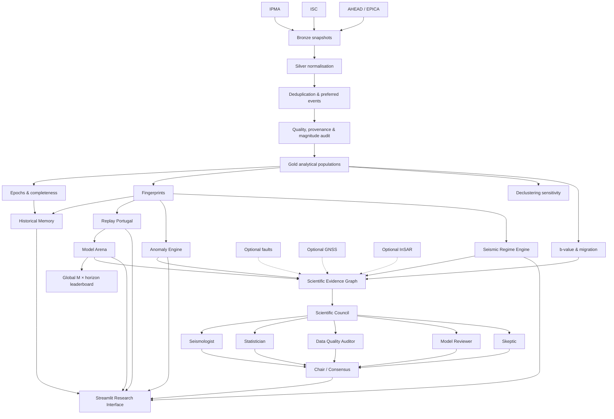

<div align="center">

# MEMÓRIA
## Portuguese Seismic Memory Observatory

**Explainable seismic intelligence, historical memory, model benchmarking and experimental tectonic analysis for Portugal.**

[](https://github.com/Gp198/memoria-seismic-observatory)
[](https://www.python.org/)
[](https://memoria-seismic-observatory-4agn9kftkhhuwx9hmagpn5.streamlit.app/)
[](LICENSE)
[](#scientific-status)

[**Open the live observatory**](https://memoria-seismic-observatory-4agn9kftkhhuwx9hmagpn5.streamlit.app/) · [**Explore the repository**](https://github.com/Gp198/memoria-seismic-observatory) · [**Read the methodology**](docs/methodology.md) · [**Scientific limitations**](docs/limitations.md)

**Created and developed by Gonçalo Pedro · Portugal**

</div>

---

## Why MEMÓRIA exists

Portugal has a long seismic history, but a long catalogue is not automatically a comparable catalogue.

Historical macroseismic records, early instrumental observations and modern digital networks differ in detection capability, spatial coverage, magnitude scales, reporting practices and completeness. A direct comparison between centuries can therefore create patterns that are partly observational rather than tectonic.

**MEMÓRIA was created to ask a more careful question:**

> **Can the present seismic state be compared with the past in a transparent, reproducible and scientifically auditable way — and can those historical analogies survive retrospective validation?**

The project does not try to guess the date, location or magnitude of the next earthquake. Instead, it builds an open research environment where seismic states can be compared, hypotheses can be replayed against history, models can compete against simple baselines, uncertainty remains visible, and AI reviewers are encouraged to challenge rather than reinforce conclusions.

---

## What MEMÓRIA is

MEMÓRIA v2.0.4 is an experimental research platform combining:

- multi-source seismic catalogue integration;
- Bronze / Silver / Gold data engineering;
- provenance, duplicate reconciliation and quality auditing;
- epoch-aware catalogue comparability;
- completeness-aware seismic fingerprints;
- explainable historical-state similarity;
- leakage-safe retrospective replay;
- multivariate seismic anomaly detection;
- audited exploratory Gutenberg–Richter analysis;
- epicentral and depth-migration analysis;
- recurring seismic-regime discovery;
- reproducible model benchmarking;
- optional multimodal geophysical evidence;
- an evidence graph;
- grounded multi-agent scientific review.

The platform is designed around a simple principle:

> **A useful research system should not only generate hypotheses. It should also make it easy to falsify them.**

---

## Live research preview

The current public application is available at:

### [memoria-seismic-observatory.streamlit.app](https://memoria-seismic-observatory-4agn9kftkhhuwx9hmagpn5.streamlit.app/)

The production interface exposes seven main research areas:

| Module | Purpose |
|---|---|
| **Overview** | Current comparable seismic state, map, uncertainty, temporal evolution and sensitivity to declustering |
| **Similar Memory** | Finds non-overlapping historical families with similar seismic fingerprints and explains the differences |
| **Replay Portugal** | Reconstructs past cut-off dates using only information available at that time |
| **Tectonic Intelligence** | Experimental anomaly consensus, b-value, migration, regimes and evidence traceability |
| **Model Arena** | Compares historical families, empirical frequency, Poisson and ETAS-lite under identical evaluation conditions |
| **Scientific Council** | Grounded specialist agents review evidence, weaknesses, model behaviour and alternative explanations |
| **Quality & Methodology** | Catalogue reconciliation, source coverage, completeness, magnitude provenance and scientific limitations |

---

## Architecture


The platform separates source ingestion, scientific computation, interpretive AI and user experience. LLM agents **never alter the catalogue or model outputs**.



### Architectural principles

1. **Immutable raw evidence** — source snapshots are stored in Bronze rather than overwritten.
2. **Explicit provenance** — source, original magnitude type, transformation status and uncertainty remain traceable.
3. **No silent homogenisation** — unreviewed magnitude identities or conversions are explicitly labelled.
4. **Comparable populations first** — historical comparisons are constrained by epoch and effective magnitude threshold.
5. **Temporal leakage prevention** — replay and model evaluation cannot use future information at a historical cut-off.
6. **Explainability by construction** — similarities, anomalies and model scores expose their components.
7. **AI is interpretive, not computational** — agents review calculated evidence; they do not generate scientific measurements.
8. **Negative results remain visible** — a MEMÓRIA model is allowed to lose against Poisson, empirical or ETAS-like baselines.

---

## Data sources

MEMÓRIA currently integrates public seismic information from:

| Source | Role in MEMÓRIA |
|---|---|
| **IPMA** — Instituto Português do Mar e da Atmosfera | Recent Portuguese seismic observations and local catalogue context |
| **ISC** — International Seismological Centre | Long instrumental catalogue coverage |
| **AHEAD / EPICA** | Historical and macroseismic European earthquake information |

Configured public services include:

- IPMA Open Data: `https://api.ipma.pt/open-data/observation/seismic/`
- ISC FDSN Event Web Service: `https://www.isc.ac.uk/fdsnws/event/1/`
- AHEAD/EPICA OGC WFS: `https://www.emidius.eu/services/europe/wfs`

> **Important:** the presence of IPMA, ISC or AHEAD/EPICA data does not imply institutional ownership, endorsement or affiliation. MEMÓRIA is an independent experimental project created and developed by Gonçalo Pedro.

Before redistributing source data, consult each provider's current licensing, citation and usage terms.

---

## Bronze, Silver and Gold

```text
data/
├── bronze/       # Immutable timestamped source snapshots
├── silver/       # Harmonised, auditable event catalogue
├── gold/         # Fingerprints and analytical outputs
├── external/     # Optional GNSS / InSAR datasets
└── sample/       # Synthetic demonstration data
```

### Bronze

Preserves source responses as timestamped evidence. New source states create new snapshots instead of mutating previous records.

### Silver

Builds the common scientific event model, including:

- canonical timestamps and coordinates;
- source identifiers;
- original and operational magnitude fields;
- magnitude-policy status;
- duplicate groups;
- preferred-event selection;
- quality indicators;
- declustering state;
- tectonic-domain classification;
- provenance and audit metadata.

### Gold

Produces analytical populations and rolling fingerprints. The current architecture supports four explicit populations:

- complete + operational magnitude policy;
- complete + validated magnitude policy;
- declustered + operational magnitude policy;
- declustered + validated magnitude policy.

This makes sensitivity to catalogue treatment visible instead of hiding it behind a single dataset.

---

## Comparable epochs and catalogue completeness

MEMÓRIA does not treat several centuries of observations as one homogeneous time series.

The current research configuration separates broad observational epochs and applies an effective threshold based on the configured epoch floor and estimated magnitude of completeness (`Mc`).

This allows questions such as:

> *Is the current activity elevated relative to periods observed with approximately comparable detection capability?*

rather than the weaker question:

> *Are more earthquakes recorded today than three centuries ago?*

The epoch definitions remain research configurations and should be reviewed by domain specialists before being treated as authoritative seismological boundaries.

---

## Seismic fingerprints and historical memory

Each rolling window is represented by an explainable multidimensional fingerprint. Depending on data availability, features include:

- comparable event rate and count;
- maximum and mean magnitude;
- estimated seismic-energy indicators;
- median depth and depth variability;
- spatial dispersion;
- time since the last event above selected thresholds;
- catalogue quality and completeness;
- source-profile compatibility.

The **Similar Memory** module retrieves prior states while:

- excluding the current state;
- preventing overlapping analogue families;
- using robust scaling;
- exposing the contribution of each feature to the distance;
- reporting data compatibility separately from mathematical similarity.

**Similarity is not causality and is not a forecast.**

---

## Replay Portugal

Replay Portugal is the core falsification mechanism of the historical-memory hypothesis.

For a historical cut-off date, MEMÓRIA:

1. hides all later information;
2. reconstructs the state using only data available before the cut-off;
3. retrieves earlier analogous families;
4. calculates experimental family frequency;
5. constructs empirical and Poisson baselines under comparable exposure;
6. observes what actually happened in the subsequent horizon;
7. evaluates the scores without future-data leakage.

The family score is deliberately described as a **weighted empirical frequency / score**, not as a calibrated earthquake probability unless calibration evidence supports that interpretation.

---

## Tectonic Intelligence

The Tectonic Intelligence module is an **experimental statistical research layer**. It detects changes in observed seismic behaviour; it does not infer that a major earthquake is imminent.

### Multivariate anomaly engine

Five independent signals are currently combined:

1. robust univariate deviations;
2. robust Mahalanobis distance;
3. Isolation Forest;
4. CUSUM / EWMA change detection;
5. temporal persistence.

Every component remains visible. A high score in one detector cannot silently become a tectonic conclusion.

### Three concepts that must remain separate

> **Statistical regime ≠ statistical anomaly ≠ tectonic interpretation**

- **Statistical regime** — a recurrent geometric class of historical fingerprints.
- **Statistical anomaly** — a deviation from a comparable reference population.
- **Tectonic interpretation** — a physical hypothesis requiring independent geophysical evidence and specialist review.

### Exploratory Gutenberg–Richter b-value

Operational b-values are not estimated from an uncontrolled mixture of magnitude scales. In v2.0.4, MEMÓRIA selects the dominant coherent **source + original magnitude type** population within the current observation epoch.

Validated mode accepts only reviewed/approved magnitude identities or conversions.

The displayed uncertainty is explicitly **sampling/statistical uncertainty only**. Systematic uncertainty associated with network evolution, magnitude practice, completeness and catalogue construction remains separate.

### Migration analysis

Experimental migration diagnostics estimate:

- epicentral centroid displacement;
- azimuth;
- approximate migration velocity;
- depth trend.

These quantities describe catalogue geometry. They do not by themselves demonstrate a tectonic process.

---

## Seismic Regime Engine

The regime engine learns recurring fingerprint classes and exposes transitions between them.

A label such as **“elevated regional activity”** describes similarity to a learned statistical regime. It is **not** a probability of an earthquake, an alert level or evidence of tectonic preparation.

The transition matrix is included to support research into recurring states and state changes without implying deterministic cycles.

---

## Model Arena

MEMÓRIA does not assume that its historical-memory model is superior.

The Model Arena evaluates competing approaches under the same cut-offs, domain, target magnitude and forecast horizon.

Current experimental competitors include:

- **MEMÓRIA historical families**;
- **empirical frequency**;
- **Poisson baseline**;
- **ETAS-lite experimental baseline**.

ETAS-lite is intentionally described as a transparent self-exciting baseline, **not** a scientifically calibrated implementation of ETAS.

### Evaluation metrics

The arena reports metrics including:

- Brier Score;
- Brier Skill Score relative to Poisson;
- Average Precision;
- observed positives;
- mean forecast score;
- scenario-level wins and ranks.

### Global magnitude × horizon leaderboard

v2.0.4 adds multi-scenario benchmarking across a configurable magnitude × horizon grid.

The global leaderboard reports:

- scenarios evaluated;
- mean and median BSS vs Poisson;
- mean Average Precision;
- Brier wins;
- mean Brier rank;
- proportion of scenarios with positive skill.

The leaderboard is **scenario-normalised**. It is not a pooled probability model and first place does not establish universal superiority.

Rare-event scenarios with very few positive observations must be interpreted cautiously.

---

## Scientific Evidence Graph

MEMÓRIA connects calculated conclusions to their supporting or contextual evidence.

Examples of nodes include:

- current statistical state;
- anomaly detectors;
- b-value;
- migration;
- model-performance evidence;
- optional geophysical observations.

This graph provides a machine-readable foundation for auditability and grounded AI review.

---

## Scientific Council

The **MEMÓRIA Scientific Council** is an agentic review layer designed to challenge the evidence produced by the platform.

The current reviewers are:

| Agent | Responsibility |
|---|---|
| **Seismologist** | Reviews seismological plausibility and limitations |
| **Statistician** | Audits uncertainty, sample strength, calibration and inference |
| **Data Quality Auditor** | Challenges provenance, completeness, magnitude policy and catalogue quality |
| **Model Reviewer** | Reviews benchmarking, leakage risk, skill and methodological robustness |
| **Skeptic** | Actively searches for alternative explanations and failure modes |
| **Chair / Consensus** | Synthesises only grounded reviews and preserves meaningful disagreement |

### Grounding Guard

The Council is evidence-closed by default.

Each run receives an auditable evidence package containing, among other elements:

- effective evidence date;
- selected domain and catalogue population;
- anomaly components;
- b-value metadata;
- migration diagnostics;
- data-quality context;
- Model Arena evidence when available;
- explicit flags for GNSS, InSAR and fault-context availability.

Agents may recommend obtaining missing evidence, but they may not claim that absent evidence confirms a hypothesis.

Example:

- ✅ *“GNSS data are not loaded; independent geodetic evidence would be useful.”*
- ❌ *“GNSS confirms crustal deformation.”* — blocked when no GNSS evidence is loaded.

If a response is truncated, incomplete or fails grounding, it receives at most one corrective retry. If no reviewer passes grounding, the Chair LLM is skipped and MEMÓRIA returns a deterministic research-only fallback.

### API-budget controls

The Council includes safeguards for low-quota Mistral API deployments:

- role-specific output ceilings;
- compact role-specific evidence payloads;
- sequential reviewer calls;
- one logical retry maximum;
- prompt/completion token accounting;
- cache keyed by evidence hash + selected agents + model;
- per-session API-call budget;
- configurable cooldown.

Default controls:

```text
MEMORIA_COUNCIL_MODEL=mistral-small-latest
MEMORIA_COUNCIL_MAX_API_CALLS_SESSION=16
MEMORIA_COUNCIL_COOLDOWN_SECONDS=30
```

A cached review can be reused without a new API call when the evidence package has not changed.

---

## Optional multimodal tectonic evidence

MEMÓRIA contains interfaces for independent physical evidence, but it does **not fabricate missing geophysics**.

Optional integrations activate only when reviewed data are supplied:

```text
data/external/gnss.csv
 data/external/insar.csv
config/faults.geojson
```

The repository includes `config/faults.example.geojson` only as a schema/example.

Until such evidence is loaded, the application explicitly reports:

- GNSS — not available;
- InSAR — not available;
- geological faults — not configured.

This is intentional. A missing dataset is scientifically preferable to an invented one.

---

## Mistral explanatory assistant

The sidebar assistant is separate from the Scientific Council.

It explains the current dashboard state in natural language using aggregated context such as percentiles, uncertainty, selected methodology, replay outputs and quality indicators.

It does not receive the raw Bronze/Silver/Gold files and does not alter calculations.

### Configure locally

Windows CMD:

```cmd
set MISTRAL_API_KEY=your_key_here
set MEMORIA_MISTRAL_MODEL=mistral-small-latest
python -m streamlit run app\streamlit_app.py
```

macOS/Linux:

```bash
export MISTRAL_API_KEY="your_key_here"
export MEMORIA_MISTRAL_MODEL="mistral-small-latest"
streamlit run app/streamlit_app.py
```

Or create `.streamlit/secrets.toml` from the included example:

```toml
MISTRAL_API_KEY = "your_key_here"
MEMORIA_MISTRAL_MODEL = "mistral-small-latest"
```

Never commit API keys or `.streamlit/secrets.toml`.

The application remains usable without Mistral; only AI-assisted functions are disabled.

---

# Getting started

## Requirements

- Python **3.11+**
- Git
- Internet access for live ingestion
- Optional Mistral API key for the explanatory assistant and Scientific Council

## 1. Clone the repository

```bash
git clone https://github.com/Gp198/memoria-seismic-observatory.git
cd memoria-seismic-observatory
```

## 2. Create a virtual environment

Windows CMD:

```cmd
py -3.11 -m venv .venv
.venv\Scripts\activate
```

Windows PowerShell:

```powershell
py -3.11 -m venv .venv
.venv\Scripts\Activate.ps1
```

macOS/Linux:

```bash
python3.11 -m venv .venv
source .venv/bin/activate
```

## 3. Install

```bash
python -m pip install --upgrade pip
python -m pip install -e .
```

For development/testing:

```bash
python -m pip install -e ".[dev,lint]"
```

## 4. Bootstrap a safe demo dataset

```bash
python -m src.pipeline bootstrap-demo
```

The demo events are synthetic and explicitly labelled `DEMO`. They exist only to test the end-to-end application without waiting for remote historical downloads.

## 5. Run Streamlit

```bash
python -m streamlit run app/streamlit_app.py
```

Shortcuts are also included:

```cmd
run_local.cmd
```

```powershell
.\run_local.ps1
```

```bash
chmod +x run_local.sh
./run_local.sh
```

---

## Live-data pipeline

### IPMA

```bash
python -m src.pipeline ingest-ipma --ipma-areas 7 3
```

### ISC

Windows CMD:

```cmd
python -m src.pipeline ingest-isc --start 2000-01-01 --end 2026-12-31 --min-lat 32 --max-lat 44 --min-lon -20 --max-lon -5
```

macOS/Linux:

```bash
python -m src.pipeline ingest-isc \
  --start 2000-01-01 \
  --end 2026-12-31 \
  --min-lat 32 --max-lat 44 \
  --min-lon -20 --max-lon -5
```

### AHEAD / EPICA

```bash
python -m src.pipeline ingest-ahead
```

### Rebuild analytical layers

```bash
python -m src.pipeline build-silver
python -m src.pipeline build-gold --catalogue-mode complete
python -m src.pipeline build-gold --catalogue-mode declustered
python -m src.pipeline merge-gold
python -m src.pipeline report
```

On Windows, the helper script builds Gold modes in separate processes to keep peak memory bounded:

```cmd
build_gold_all.cmd
```

### Full ingestion/build workflow

```bash
python -m src.pipeline run-all --ipma-areas 7 3
```

---

## Useful CLI commands

```bash
python -m src.pipeline bootstrap-demo
python -m src.pipeline tls-diagnostics
python -m src.pipeline data-status
python -m src.pipeline clean-derived
python -m src.pipeline build-silver
python -m src.pipeline build-gold --catalogue-mode complete
python -m src.pipeline build-gold --catalogue-mode declustered
python -m src.pipeline merge-gold
python -m src.pipeline tectonic-status --window 90
python -m src.pipeline validate-grid --catalogue-mode complete
python -m src.pipeline validate-grid --catalogue-mode declustered
python -m src.pipeline report
python -m src.pipeline run-all
```

---

## Testing and quality

Run the full test suite:

```bash
python -m pytest
```

Run linting:

```bash
ruff check .
```

Focused v2.0.4 checks:

```bash
python -m pytest -q \
  tests/test_v2_scientific_council.py \
  tests/test_v2_seismology.py \
  tests/test_v2_model_arena_leaderboard.py
```

On Windows CMD, run the same files on one line:

```cmd
python -m pytest -q tests\test_v2_scientific_council.py tests\test_v2_seismology.py tests\test_v2_model_arena_leaderboard.py
```

Release-specific validation notes are available in [`VALIDATION_v2.0.4.md`](VALIDATION_v2.0.4.md).

---

## Repository structure

```text
memoria-seismic-observatory/
├── app/
│   └── streamlit_app.py
├── config/
│   ├── domains.geojson
│   ├── faults.example.geojson
│   ├── magnitude_conversion_policy.json
│   └── settings.json
├── data/
│   ├── bronze/
│   ├── silver/
│   ├── gold/
│   ├── external/
│   └── sample/
├── docs/
├── reports/
├── src/
│   ├── agents/          # Scientific Council
│   ├── anomalies/       # Multivariate anomaly engine
│   ├── assistant/       # Mistral explanatory assistant
│   ├── backtesting/     # Replay and validation
│   ├── evidence/        # Scientific Evidence Graph
│   ├── features/        # Seismic fingerprints
│   ├── geography/       # Tectonic domains
│   ├── geophysics/      # Fault context
│   ├── ingestion/       # IPMA, ISC, AHEAD/EPICA
│   ├── models/          # Model Arena and ETAS-lite
│   ├── multimodal/      # GNSS and InSAR interfaces
│   ├── quality/         # Completeness, deduplication, magnitude, declustering
│   ├── regimes/         # Seismic regime engine
│   ├── reporting/
│   ├── seismology/      # Gutenberg–Richter and migration
│   └── similarity/      # Historical nearest-state retrieval
├── tests/
├── pyproject.toml
└── README.md
```

---

## Scientific status

**Current status: Public Research Preview / advanced research prototype.**

MEMÓRIA is suitable for:

- exploratory research;
- methodological experiments;
- catalogue-quality analysis;
- reproducible model comparison;
- historical analogue studies;
- open-science collaboration;
- technical demonstrations and education.

MEMÓRIA is **not** currently suitable for:

- deterministic earthquake prediction;
- public earthquake alerts;
- official seismic-hazard assessment;
- civil-protection decision support;
- claims that a statistical anomaly is evidence of an imminent earthquake;
- automatic physical interpretation without independent geophysical evidence.

### Scientific constraints still requiring specialist review

Key open challenges include:

- regional magnitude homogenisation and validated conversions;
- low coverage of reviewed magnitude transformations in some analytical populations;
- formal review of catalogue completeness by domain and epoch;
- replacement/review of pilot tectonic polygons with authoritative or peer-reviewed definitions;
- comparison with a fully calibrated ETAS implementation;
- formal declustering comparison with established methods such as Gardner–Knopoff and Reasenberg;
- integration of reviewed fault geometry;
- GNSS and InSAR evidence where scientifically appropriate;
- larger rare-event validation samples;
- external seismological review of interpretation and communication.

---

## Scientific guardrails

MEMÓRIA intentionally enforces the following language and design boundaries:

| The platform may say | The platform must not infer automatically |
|---|---|
| “The current state is in the 85th comparable percentile.” | “A major earthquake is approaching.” |
| “One anomaly detector is triggered.” | “A tectonic anomaly is confirmed.” |
| “This historical family is mathematically similar.” | “The same future sequence will occur.” |
| “ETAS-lite has lower Brier Score in this scenario.” | “ETAS is universally superior.” |
| “The current regime resembles elevated regional activity.” | “Earthquake probability is elevated.” |
| “GNSS evidence is unavailable.” | Invented deformation or physical confirmation |

For public safety and official seismic information in Portugal, consult **IPMA** and **Proteção Civil / ANEPC**.

---

## Research questions MEMÓRIA can support

The platform is intended to make questions testable rather than merely visual. Examples include:

- How sensitive is a current activity percentile to catalogue completeness?
- Do historical analogues add predictive skill over empirical or Poisson baselines?
- Does that conclusion change after declustering?
- Which fingerprint variables dominate apparent historical similarity?
- Are detected changes persistent across independent anomaly methods?
- Does b-value behaviour remain stable when restricted to a coherent magnitude population?
- Do model rankings change across magnitude and forecast horizon?
- How often does a high historical-family score fail in retrospective replay?
- Can statistical regime transitions be reproduced across domains?
- Which conclusions disappear when data-quality assumptions are tightened?

Negative answers are valid scientific outcomes.

---

## Roadmap

The next phase is deliberately focused more on **scientific validation than feature count**.

### Priority research work

- [ ] External review by seismologists / geophysicists
- [ ] Reviewed regional magnitude-conversion policy
- [ ] Stronger validated-magnitude coverage
- [ ] Full magnitude × horizon benchmark publication
- [ ] Established declustering-method comparison
- [ ] Calibrated ETAS benchmark
- [ ] Reviewed geological fault geometries
- [ ] GNSS integration with provenance and uncertainty
- [ ] InSAR integration with provenance and uncertainty
- [ ] Cross-domain validation beyond the initial Portuguese pilot domains
- [ ] Reproducible technical report / preprint release
- [ ] DOI-backed software release and citation metadata

### Long-term research direction

The long-term goal is an **open, explainable seismic and geophysical research environment** capable of combining historical memory, modern observations, model competition, uncertainty and independent physical evidence — without turning exploratory signals into deterministic predictions.

---

## Contributing

Scientific criticism is especially welcome.

Useful contributions include:

- review of tectonic-domain definitions;
- magnitude-homogenisation literature and regional conversion models;
- completeness methodology;
- declustering implementations;
- ETAS calibration;
- GNSS / InSAR integration methodology;
- statistical validation;
- reproducibility improvements;
- additional public seismic datasets;
- issue reports and code review.

If proposing a scientific change, please describe:

1. the hypothesis or methodological issue;
2. the evidence or literature supporting the change;
3. expected impact on existing analyses;
4. how the change can be validated retrospectively.

Open an issue or pull request at:

**https://github.com/Gp198/memoria-seismic-observatory**

---

## Reproducibility and provenance

For serious experiments, record at minimum:

```text
MEMÓRIA version
Git commit SHA
Dataset snapshot date
Selected tectonic domain
Catalogue mode
Magnitude policy
Analytical window
Magnitude threshold / Mc
Replay target and horizon
Model configuration
```

Generated research outputs should preserve enough metadata to reproduce the analytical population and configuration used.

---

## Security and secrets

Never commit:

- `MISTRAL_API_KEY`;
- `.streamlit/secrets.toml`;
- private credentials;
- restricted source datasets.

The included `.gitignore` and secrets example are intended to support safe local and Streamlit deployments.

---

## Corporate HTTPS / certificate environments

MEMÓRIA uses the operating-system trust store through `truststore`, which is useful in Windows environments where a corporate proxy, VPN or security product adds an internal certificate authority.

Diagnostics:

```cmd
.venv\Scripts\activate
python -m pip install --upgrade -e .
python -m src.pipeline tls-diagnostics
```

See [`docs/windows_certificates.md`](docs/windows_certificates.md) and [`docs/windows_installation.md`](docs/windows_installation.md) for additional troubleshooting.

---

## Automation

A daily IPMA snapshot workflow is included at:

```text
.github/workflows/daily-ipma.yml
```

When enabled, it can ingest a timestamped Bronze snapshot and rebuild analytical outputs. Review repository permissions, source terms and desired publication behaviour before enabling automated commits in a public research repository.

---

## Citation

Until a DOI-backed release is published, the software can be referenced as:

> **Pedro, Gonçalo. (2026). MEMÓRIA — Portuguese Seismic Memory Observatory, v2.0.4. Open-source research software.**  
> https://github.com/Gp198/memoria-seismic-observatory

A future release should add `CITATION.cff` and an archived DOI (for example through Zenodo) so software and methodological versions can be cited reproducibly.

---

## License

The source code is released under the [MIT License](LICENSE).

Source datasets remain subject to the terms, licences and citation requirements of their respective providers. The MIT licence for the software does not override third-party data rights.

---

## Independence and disclaimer

MEMÓRIA was **created and is developed by Gonçalo Pedro** as an independent experimental research project.

It is **not an official product, initiative or service of IPMA, ISC, AHEAD/EPICA, ANEPC or any other data provider or public authority**.

The system does not predict with certainty the date, location or magnitude of future earthquakes and must not be used as a substitute for official seismic information, hazard assessment or civil-protection guidance.

---

<div align="center">

### MEMÓRIA

**Historical memory · Explainable models · Reproducible validation · Scientific uncertainty**

[Live Research Preview](https://memoria-seismic-observatory-4agn9kftkhhuwx9hmagpn5.streamlit.app/) · [GitHub Repository](https://github.com/Gp198/memoria-seismic-observatory)

</div>
